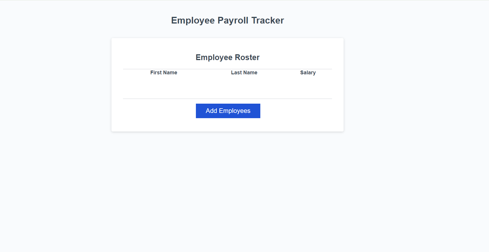
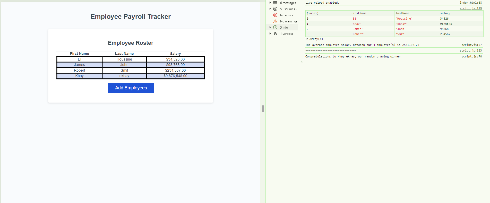

# Employee-Payroll-Tracker

## Description

The site is used to enable a payroll manager to view and manage employee payroll data. This app run in the browser and will feature dynamically updated HTML and CSS powered by JavaScript code. The manager will get a series of prompts that need to fill up accordantly.
After all employees are entered, the application then will list and sort the employees base on the last name and display all their properties.
The console on the other hand will print the average salary and select a random employee.

## Installation

N/A

## Usage

The site provide a tool to enter employees salary and sort, list them.

## Credits

N/A

## License

Please refer to the LICENSE in the repo.

## Link and screenShot

- link to the deployed application: https://ekhay-hit.github.io/Employee-Payroll-Tracker/

- ScreenShot for the deployed application:
  
  
